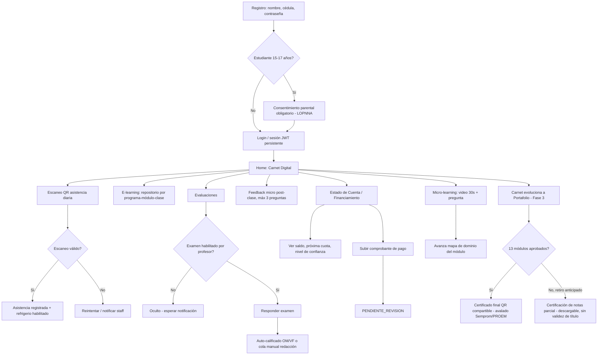
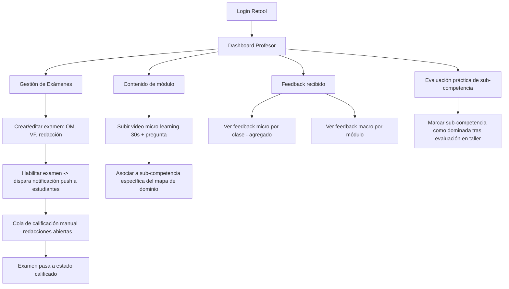
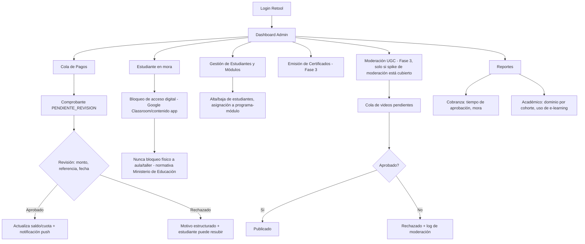
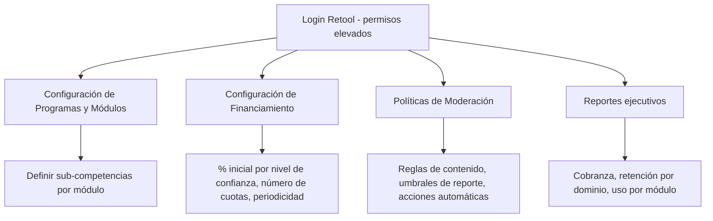

# FLUJOS DE USUARIO POR ROL — ZR APP
> Documento complementario a `00_CONTEXTO_MAESTRO_AGENTE.md`. Mapea pantalla por pantalla y
> estado por estado el recorrido de cada rol. Un agente de código debe usar este archivo para
> derivar rutas/pantallas de FlutterFlow (estudiante) y vistas de Retool (profesor/admin), y
> los diagramas Mermaid como referencia de máquina de estados al diseñar tablas y triggers.

## 0. ESTADO DEL GAP ANTERIOR — RESUELTO
La versión anterior de este documento advertía que `04_ESQUEMA_BASE_DATOS.md` no existía.
**Ese archivo ya fue creado** con el esquema relacional derivado de las reglas de negocio
confirmadas por la Junta (ver ese archivo directamente). Lo que sigue pendiente **no es el
esquema en sí**, sino dos decisiones de arquitectura que el esquema no puede resolver por su
cuenta — ver `07_REGISTRO_DE_CAMBIOS_Y_GAPS_ABIERTOS.md`:
1. Integración (o no) con Google Classroom para contenido y bloqueo por mora.
2. Reglas exactas de progresión entre niveles Cash & Carry (cuántos pagos puntuales para subir
   de nivel).

Un agente de código puede construir migraciones directamente desde `04_ESQUEMA_BASE_DATOS.md`,
pero debe dejar explícitamente parametrizables (no hardcodeadas) las dos decisiones anteriores
hasta que se resuelvan.

## 1. FUNDAMENTO DEL REDISEÑO DE GAMIFICACIÓN (por qué se abandonó el modelo de racha tipo Duolingo)
Referencia rápida para cualquier agente o desarrollador que se pregunte por qué `00_` y `03_`
ya no usan racha/streak como mecánica central:
- Duolingo bajó su abandono mensual de 47% (2020) a 28% (mercados principales, ~2023) tras años
  de rediseño de producto dedicado, explotando aversión a la pérdida en un público **voluntario**
  sin nada en juego. No es una mecánica que se "agrega", es un motor de producto completo.
- El estudiante de ZR ya pagó matrícula, asiste presencialmente y tiene objetivo laboral
  concreto — motivación intrínseca real preexistente (el oficio), distinta a la de un usuario
  casual de una app gratuita.
- Meta-análisis en educación (2023-2025) muestran efecto pequeño-a-moderado de la gamificación
  sobre motivación (Hedges' g entre 0.26 y 0.65 según el estudio), con mejora real en percepción
  de autonomía/pertenencia pero **impacto mínimo en percepción de competencia** — la variable
  que más predice motivación sostenida a largo plazo.
- Decisión de diseño: usar el **formato** de consumo audiovisual corto (por preferencia real del
  rango 15-25) sin copiar el **mecanismo** de enganche por pérdida. El eje de retención pasa a
  ser dominio visible y verificable (mapa de sub-competencias, portafolio), no racha diaria.

## 2. FLUJO — ESTUDIANTE

### 2.1 Mapa de pantallas (Fase 1 → Fase 3)

### 2.2 Estados clave del estudiante que el agente debe modelar
- `onboarding_status`: en curso / completo (objetivo: registro + primer login < 60s, más el
  paso de consentimiento parental si aplica — ver 2.1).
- `parental_consent_status`: `no_aplica` (mayor de edad) / `pendiente` / `otorgado` — bloquea
  el uso de la cuenta si el estudiante es menor y el consentimiento sigue pendiente.
- `attendance_scan_status`: por sesión/día — vinculado 1:1 al mismo evento que habilita
  refrigerio (no crear tabla separada, ver `00_`, sección 3.8).
- `exam_status` por examen: `oculto → habilitado → en_progreso → entregado → calificado`.
  Calificación numérica sobre 20; aprobación individual desde 10 (ver `00_`, sección 3.4).
- `module_status`: agrega teoría (50%) + práctica (50%) + participación (mín. 5%, a criterio
  del profesor); aprobado con ≥12 puntos (≥10 solo en el primer módulo del programa).
- `financing_status`: nivel Cash & Carry (aplica desde el módulo 2; `NULL` durante el módulo 1,
  que siempre usa la estructura fija 40%/20%/20%/20%), saldo, cuota próxima, historial de pagos.
- `mastery_map`: por sub-competencia (origen: Guías de Aprendizaje digitalizadas) —
  `no_iniciado / en_progreso / dominado`.
- `certification_status`: `en_curso` / `certificado_final` (13 módulos aprobados, avalado
  Semprom/PROEM) / `certificado_parcial_emitido` (retiro anticipado, certificación de notas).
- **Nunca mezclar** en el mismo modelo de datos el contenido curricular (Flujo A) con el UGC de
  Fase 3 (Flujo B) — ver `03_MODULO_SOCIAL_VIDEO.md`, sección 1.

### 2.3 Fricciones a evitar (regla transversal de diseño)
Cualquier pantalla del estudiante que agregue un paso debe justificar qué fricción elimina en
otro lado (principio no negociable de `00_`, sección 0). Ejemplo: subir comprobante de pago es
fricción aceptable porque elimina la fila física de caja; una notificación diaria de "racha a
punto de romperse" NO se justifica bajo este principio y por eso no es mecánica central.

## 3. FLUJO — PROFESOR

### 3.1 Notas para el agente
- El profesor **nunca** modifica saldos, cuotas ni aprueba pagos — eso es exclusivo de
  Administración (separación de permisos por rol, no solo por UI).
- La habilitación de examen es un evento que debe disparar notificación (OneSignal) y cambiar
  `exam_status`, no solo un cambio visual en Retool.
- La marca de "sub-competencia dominada" por evaluación práctica en taller es la única fuente de
  verdad de dominio que no depende de auto-calificación — importante para la integridad del
  mapa de dominio del estudiante.

## 4. FLUJO — ADMINISTRACIÓN

### 4.1 Notas para el agente
- Todo comprobante aprobado/rechazado es **inmutable** — una corrección crea un nuevo registro,
  nunca edita el original (ver `02_MODULO_FINANCIAMIENTO.md`, sección 2.1). Esto debe reflejarse
  como constraint de base de datos, no solo como regla de UI.
- SLA de revisión (sugerido 24h hábiles) debe ser un dato monitoreable en el dashboard de
  reportes, no solo una meta documental.
- El módulo de moderación (F) **no se construye hasta que el spike de moderación de Fase 0 esté
  resuelto con una persona/rol asignado** — ver `05_ROADMAP_FASES.md`.

## 5. FLUJO — SUPER ADMIN / DIRECCIÓN ACADÉMICA

### 5.1 Notas para el agente
- Los porcentajes de financiamiento y las reglas de moderación **no deben estar hardcodeados**
  en ningún cliente (FlutterFlow/Retool) — viven en configuración server-side (Supabase),
  editable solo por este rol (ver `01_STACK_TECNICO_LOWCODE.md`, sección 4).

## 6. ENTIDADES QUE CRUZAN ROLES (referencia rápida para el agente)
El esquema completo y autoritativo ya vive en `04_ESQUEMA_BASE_DATOS.md`. Esta tabla es solo
un mapa rápido de qué entidad toca qué rol — para el detalle de columnas, ir al esquema:

| Entidad | Roles que la tocan | Notas |
|---|---|---|
| `students` | Estudiante, Admin | Datos base + nivel de confianza actual + estado de consentimiento parental |
| `parental_consents` | Estudiante (representante), Admin | Confirmado Fase 1 para 15-17 años — ver `03_MODULO_SOCIAL_VIDEO.md` sección 2 |
| `attendance_events` | Estudiante, Admin | Mismo evento habilita refrigerio |
| `exams` / `exam_attempts` | Estudiante, Profesor | Escala sobre 20, aprobación individual desde 10 |
| `modules` / `module_grades` | Estudiante, Profesor | 50% teoría + 50% práctica + participación mín. 5%; aprobación ≥12 (≥10 en módulo 1) |
| `learning_videos` / `mastery_map` | Estudiante, Profesor | Flujo A — origen: Guías de Aprendizaje digitalizadas; separado de UGC |
| `financing_plans` / `installments` / `payments` | Estudiante, Admin, Super Admin | Append-only en `payments`; módulo 1 con estructura fija, módulo 2+ con niveles Cash & Carry |
| `snack_fund_ledger` | Admin, Super Admin | 30% del excedente del inicial de $60 reservado para refrigerios |
| `points_redemptions` / `academic_incentive_redemptions` | Estudiante, Admin | Movimiento contable, no resta simple |
| `feedback_micro` / `feedback_macro` | Estudiante, Profesor | Dispara insignia al completar macro |
| `certifications` / `partial_transcripts` | Estudiante, Admin | Certificado final (13 módulos) vs. certificación de notas parcial (retiro anticipado) — entidades separadas |
| `ugc_videos` / `moderation_log` (Fase 3) | Estudiante, Admin | No antes de spike de moderación (sigue sin responsable asignado) |

## 7. MÉTRICAS DE ÉXITO POR FASE (para dashboards de reportes, no solo para "saber si funcionó")
- **Fase 1:** horas de personal ahorradas en asistencia/calificación manual, no número de logins.
- **Fase 2:** tasa de mora antes/después; % de sub-competencias dominadas y tasa de finalización
  de micro-learning por módulo — **no** días de racha consecutiva.
- **Fase 3:** ratio de videos reportados/aprobados, tiempo promedio de moderación.
